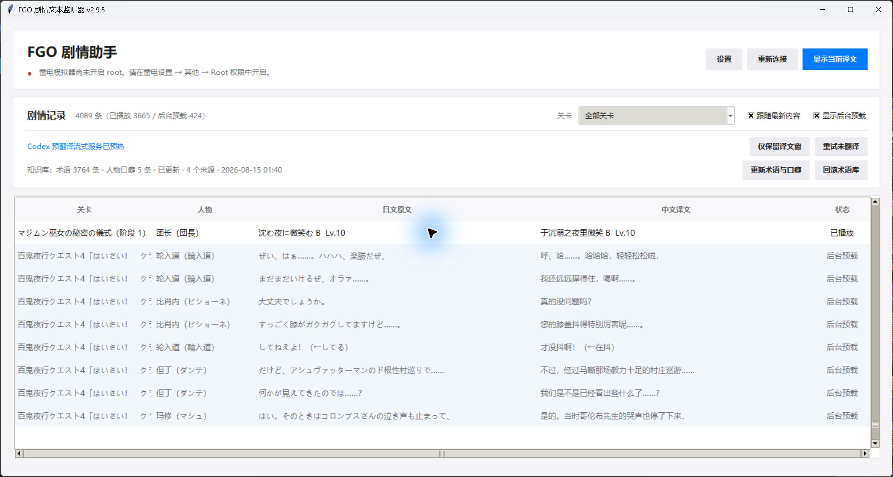
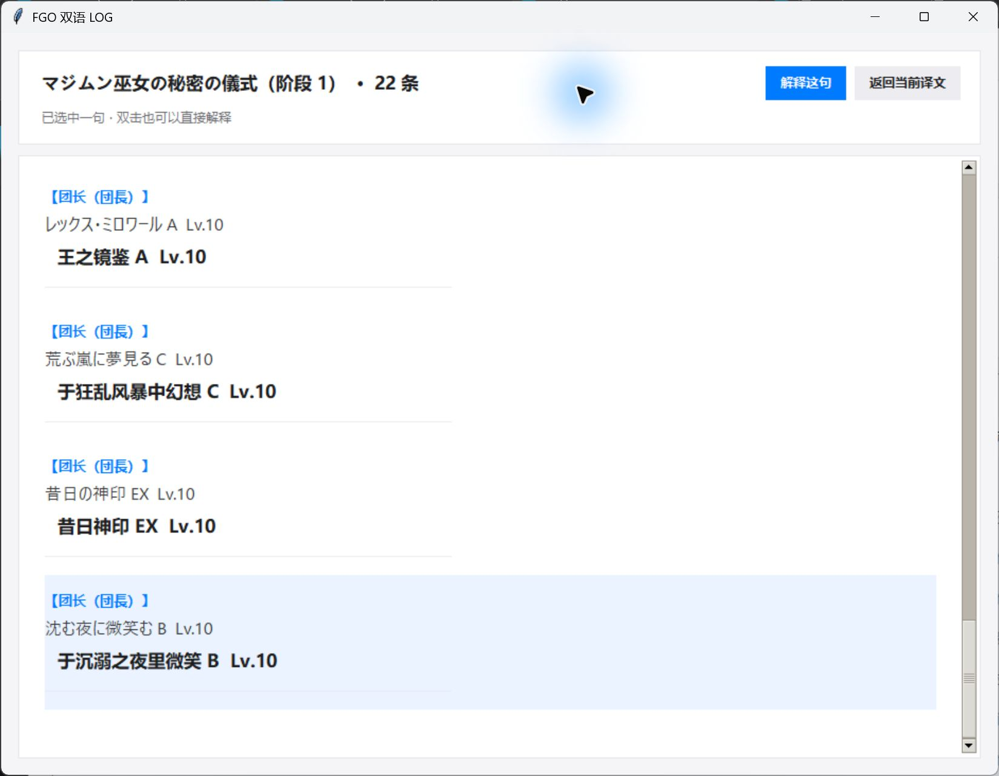

# FGO 剧情文本监听器

> Windows · 雷电模拟器 9 · 日服 FGO · IL2CPP 只读 Hook · Codex 连续翻译

实时读取日服 FGO 的剧情台词、人物名、选项与游戏 LOG，使用本机已登录的
`codex-cli` 生成中文译文，并保存为可筛选、复制和导出的双语历史记录。

当前版本：**v2.9.8**

### v2.9.8 CLI 自动发现修复

- 扫描 PATH 中的 Codex 和 Windows 桌面版的已知安装目录，实际执行 `--version`，按版本选择可正常启动的新版；不再无条件优先选旧的 `codex.cmd`。
- 不硬编码桌面版的版本目录；安装变化时重新探测，正常翻译批次复用探测结果。显式填写的 CLI 路径仍优先。
- GPT-6 是否出现以选中 CLI 的模型目录为准，不向列表塞固定型号。
- 按用户要求，新版验证成功后删除旧安装目录、旧压缩包和回滚备份，只保留最新版；不触碰剧情数据库。

### v2.9.7 模型目录修复

- 打开 AI 翻译设置时，在后台通过当前配置的 Codex CLI `model/list` 查询模型，支持分页与手动刷新；不再向下拉框插入固定型号。
- 推理强度和 Fast 支持读取模型目录，不再用固定名单猜测。查询不占用正在翻译的会话，不阻塞原文捕获。
- 显示目录来源、查询时间和失败原因；失败使用未验证的缓存，无缓存时允许手动填写。CLI 可能使用自身缓存，目录不等于云端最新全集；缺少新模型时检查 CLI 版本与账号权限。
- 刷新、旧配置加载以及“需要新版 Codex”错误均不会覆盖用户模型选择；版本错误提示升级或手动换模型，原文保留并可重试。
- 首次安装的翻译默认值只是初始配置，不是可用模型名单或“最新模型”声明；可在设置中修改。

协议依据：[OpenAI Codex App Server 模型目录](https://learn.chatgpt.com/docs/app-server#list-models-modellist)。

> [!IMPORTANT]
> 监听器是只读工具：不会发送点击、触摸、按键或剧情选择，不修改原始 APK，
> 也不会安装辅助 APK。原始日文和原始字段始终保留，翻译仅作为附加数据保存。

## 功能亮点

- **权威文本源**：优先读取 IL2CPP managed string、完整剧情数组和游戏自身 backlog；不依赖截图 OCR。
- **低延迟双通道翻译**：当前句/选项与整关预翻译使用独立 Codex 会话，互不阻塞。
- **双语历史**：按关卡筛选、批量复制、导出 TXT，并区分“已播放”和“后台预载”。
- **剧情解释**：结合当前关卡上下文解释指代、语气和前因后果，可按需联网查证。
- **可追溯术语库**：整合 Atlas Academy、Mooncell 与人工校对规则，支持更新和回滚。
- **保守降级**：Hook、预载或翻译失败不会阻断原文采集，失败译文可稍后重试。

## 界面截图

### 剧情记录主窗口



### 游戏式双语 LOG



## 环境要求

- Windows 10/11 x64
- 雷电模拟器 9（Android 9），已开启 **ADB 本机连接** 和 **Root 权限**
- 日服 FGO：`com.aniplex.fategrandorder`
- 已安装并登录 `codex-cli`（AI 翻译与“解释这句”需要）
- 从源码构建时需要 Python 3.11、Git LFS 和 PowerShell

## 快速开始

### 使用发布包

1. 从仓库的 **Releases** 页面下载最新的 `FgoStoryListener-*-win64.zip`。
2. 完整解压压缩包；不要只把 EXE 单独复制出来。
3. 在雷电模拟器设置中开启 **ADB 本机连接** 和 **Root 权限**，然后重启模拟器。
4. 启动 FGO，再运行 `FgoStoryListener.exe`。
5. 等状态显示“监听中”后进入剧情。

首次使用 AI 翻译前，请先在终端确认 Codex CLI 已登录：

```powershell
codex login
```

### 从源码运行

```powershell
git clone <repository-url>
cd FgoStoryListener
git lfs pull

python -m venv .venv
.\.venv\Scripts\Activate.ps1
python -m pip install -r requirements-build.txt
python .\fgo_story_listener.py
```

### 测试与打包

```powershell
# 单元测试
python -m unittest discover -s tests -v

# 生成 dist-v2.9.8\FgoStoryListener
.\build.ps1
```

`runtime/` 下的 Frida Server/Gadget 使用 Git LFS 管理。克隆后若未执行
`git lfs pull`，PyInstaller 虽可能完成，但发布包将缺少可用的运行时文件。

## 使用

1. 在雷电模拟器设置中开启 **ADB 本机连接** 和 **Root 权限**，重启模拟器。
2. 启动 FGO。
3. 运行 `FgoStoryListener.exe`，等状态显示“监听中”。
4. 进入剧情；监听器会先直接读取游戏自己的 `LOG` 历史，再接着实时监听新台词。
5. 剧情选择框出现时，所有选项以及最终选中的一项都会写入历史。
6. 选中一行或多行后可直接按 `Ctrl+C`，也可使用“复制选中”“复制全部”或“导出 TXT”。
7. 界面中的“关卡筛选”可以只显示、复制或导出当前关卡的记录。
8. “设置”中可以分别选择实时翻译与完整剧情预翻译的 Codex 模型、推理强度和 Fast 模式，并控制当前译文窗口。
9. 当前译文会自动显示日文和中文；点击“查看 LOG”会打开当前关卡的双语记录页，默认停在最新一句，可直接向上滚动查看、选择并按 `Ctrl+C` 复制，不再打开主窗口。
   主窗口、当前译文和双语 LOG 都使用 Windows 默认窗口层级，不使用 `topmost` 或强制抢焦点。
   人物名也会显示为 `中文名（日文原名）`：先使用更新术语库中的精确、可追溯名称；词库没有的剧情昵称由当前翻译批次生成并按关卡缓存。无人物名的旁白、场景描写和内心文字仍保持空白。
10. 点击“更新术语与口癖”，程序会在后台重新读取日服/国服游戏数据、Mooncell 从者、活动及日中语音表；监听和旧知识库在构建期间保持可用。
11. 看不懂某句话时，点击当前译文中的“解释这句”，或在双语 LOG 中点选一句后点击“解释这句”。程序会把该关卡现有的完整双语剧情和目标句一起交给 Codex；遇到当前关卡无法解释的旧剧情指代、人物别称或多年以前的梗时，默认按需联网查证。解释会说明字面意思、以前发生过什么、当前前因后果、语气与言外之意，并列出可点击的参考页面。它默认避免泄露目标句之后的事件，并会缓存到历史数据库；重复查看不再调用模型。

默认复制格式：

```text
リリス 「べっつにい~？ メニューに不満はないですけど~？それよりプロテアは今のままでいいの?」
译：才、才没有呢～？我对菜单没什么不满啦～？比起这个，普洛提亚维持现在这样真的好吗？
```

历史数据库保存在：

```text
%LOCALAPPDATA%\FgoStoryListener\history.db
```

## AI 翻译

- 从 v2.8 起使用两套完全独立的翻译配置。实时当前句、剧情选项和游戏 LOG 默认使用 `gpt-5.6-terra / low / Fast / app-server`；完整剧情预翻译和“解释这句”默认使用 `gpt-5.6-sol / high / Fast / codex exec`。
- 当前电脑的 Codex 模型目录把 `gpt-5.6-terra` 标为日常工作的均衡模型，并提供 Fast 服务层；实时翻译采用 low 推理以缩短选项出现后的等待。`gpt-5.6-sol / high` 保留给不阻塞当前画面的后台高质量翻译。
- 两套队列由不同线程、不同常驻进程执行。即使 Sol 正在翻译一批完整关卡剧情，刚出现的选项仍可立即进入实时常驻会话，不需要等待后台批次结束。
- FGO 的选择项不在当前可靠的完整消息槽中：脚本预载会明确排除 `select` 控制指令，直到 `ScriptSelectDialog.Open` 提供真正的 managed string 选项数组后才抓取。因此选项属于实时翻译，而不是预翻译；程序不会猜测尚未实例化的分支文字。
- 两套配置默认开启 Codex `Fast` 服务层（协议值 `priority`）。本机模型目录将其说明为约 1.5× 速度，但会增加额度消耗；可分别关闭。当前模型目录确认 `gpt-5.6-terra`、`gpt-5.6-sol` 和 `gpt-5.6-luna` 支持，选择不支持的模型时软件会明确提示而不会假装生效。
- 设置通过当前 Codex CLI 的 `model/list` 动态查询模型，失败才回退到明确标注的缓存；支持手动刷新，不保证 CLI 目录等于云端最新全集。
- 服务端返回“requires a newer version of Codex”时，提示升级 CLI 或手动换模型，不覆盖实时或预翻译模型选择；失败内容保留在数据库，可用“重试未翻译”重新加入队列。
- 实时队列和完整剧情预翻译队列各自使用独立的 `codex app-server` 常驻进程；实时侧为每个关卡保留临时连续会话，省去每句重新启动 CLI 和重复发送上下文的开销。预翻译仍固定使用自己的 Sol/high 配置，不会改动或占用实时模型的会话。
- v2.9.5 使用“当前关卡整关自适应”：同一关卡不超过 256 个片段且日文总量不超过 12000 字符时，一次提交全部片段；超过任一安全预算才回退为每批 100。不同关卡永远不混在同一请求中。模型必须按输入顺序输出，每生成完一个对象就立刻校验、写入 SQLite，并供当前画面命中；当前单句中文也会按 token 流式显示。
- 新台词到来时会中断仍在占用实时通道的旧句，先处理当前画面；旧句自动回到历史补译队列，不丢原文、不丢历史。
- 剧情选项翻译后，玩家选中的那一项直接从已译选项中精确取出，不再为“已选择”记录重复调用模型；只有原选项翻译确实失败时才回退为单句翻译。
- 常驻会话使用 `ephemeral`、`read-only`、空工具列表和 `approvalPolicy=never`；不会修改 `~/.codex/config.toml`，也不会读取已有 Codex 对话。兼容模式仍使用 `--ephemeral --ignore-user-config --ignore-rules -s read-only`。
- 当前屏幕的新台词拥有最高翻译优先级；旧 LOG 在后台每批最多 12 条补译，不会再让新台词排在大量历史记录后面。上一批同关卡双语台词会作为连续会话上下文，以保持称呼和语气一致。
- `AddText` 的日文原文会在 Hook 回调当帧先显示为非持久预览；用于避免残句的 220ms 合并窗口只负责最终数据库记录和 AI 请求，不再阻塞原文反馈。
- 游戏 LOG 每新增一条和进入关卡收到预载脚本时，主窗口只增量更新变化行；不再同步删除并重建几千条 Treeview 记录。通常追加式 LOG 使用 O(n) 精确对齐，复杂乱序才回退到保守 LCS。
- 默认开启“进入剧情后读取完整脚本并在后台预翻译”。游戏载入剧情后，Hook 会只读取得 `ScriptManager` 已解析的消息数组，未来台词先隐藏翻译；实际播放到完全相同的日文时才激活对应译文。分支中未选择的台词不会提前显示；完整脚本读取失败时仍自动回退到原有逐句实时翻译。
- 关卡名只用于本地分组、筛选和维持同关卡会话，不再发送给模型。可靠识别出的战斗技能等级标签（例如 `聖剣作成 EX Lv.10`）及固定系统声明会保留在本地历史中，但标记为“已跳过”，不会进入翻译队列、上下文或悬浮剧情，从而不消耗 AI Token。
- 人物名翻译优先从本地术语库精确命中，不额外消耗 Token；只有词库没有的剧情昵称才随正文翻译一并返回 `speaker_zh`，并按“关卡＋日文名”缓存，不单独重复请求模型。
- 随安装包提供的术语基线来自 `memory/fgo_knowledge_base.json`。当前基线含 3700+ 个日中从者名、战斗名、灵衣、宝具、技能和活动名。
- 每一批翻译只检索当前人物/台词真正命中的术语（最多 120 条），而不是把整个词库塞进提示词；词库可以持续增长而不会线性拖慢每一句翻译。
- 模型自动总结的称呼/关系只保存在 SQLite 的当前关卡记忆中，并且必须带台词证据 ID，不会自动污染全局术语。
- 人物口癖采用独立于普通术语的角色规则。红阎魔的 `でち／まちゅ／まちぇん／まちた／まちょう` 固定按 Mooncell 惯例译为句尾“啾”，禁止漂移成“哒”；旧版本中已保存的句尾“哒”会在启动时按“人物 + 日文口癖 + 中文句尾”三重条件自动修复。
- 其他人物不会因为一条台词就被“猜”出口癖：模型可提交人物专属的非标准句尾候选，SQLite 只在同一人物、同一日文标记、同一中文呈现累计到至少 3 条不同台词后启用；普通 `です／ます` 和常见中文语气词被排除，冲突译法会隔离而不会覆盖已启用规则。
- 翻译失败不会影响原文抓取；原文永久先保存，可点击“重试未翻译”。

## 剧情解释

- “解释这句”不是重新翻译单句。它会读取目标句所属关卡的全部已保存记录，包括已播放内容和完整剧情预载，再把目标 `id` 明确标记给 Codex。
- v2.9 默认为“解释这句”单独开放 Codex 实时 Web Search。当前关卡无法确认“那位 CEO”一类跨活动指代时，会搜索日文原句、人物与活动名，优先核对官方 FGO、fgo.wiki、Atlas Academy 和可核对原文的成熟 Wiki；关键身份尽量交叉验证。实时翻译与剧情预翻译不联网，因此不会受影响。
- 为控制等待时间和 Token，一次解释最多进行 6 次针对性检索、打开 4 个最相关页面，证据充分即停止。设置里可以关闭联网解释。
- 输出固定分为“这句话在说什么”“以前发生过什么”“放在这段剧情里”“语气与言外之意”“需要留意”“联网参考”和“不确定之处”。“联网参考”保留实际使用页面的标题、摘要和可点击 URL；搜索后仍无法确认的部分才进入“不确定之处”。
- 完整脚本中可能包含尚未播放的后续台词；提示词允许它们用于消歧，但禁止在解释中主动泄露后续事件，也禁止引用本关卡之外的剧透。
- 每条解释只在首次生成或用户主动点击“重新解释”时调用 Codex。成功结果保存在 `history.db` 的独立缓存表中。旧版离线解释在首次用 v2.9 打开时会自动重新生成一次联网版，之后继续使用缓存。

## 界面与交互

- v2.7 使用统一的浅色视觉系统：中性背景、白色内容卡片、蓝色主操作、清晰的标题层级和更大的点击区域；不使用模拟透明、持久置顶或抢焦点。
- 主窗口用于数据库管理和筛选；当前译文窗口只保留阅读所需的原文、译文、LOG 与解释；双语 LOG 支持单击选择、双击解释、滚轮浏览及原生 `Ctrl+C`。
- 主要操作使用蓝色按钮，普通操作使用中性按钮，清空历史使用独立的红色弱警示样式，减少误触。

## 可更新术语库

- **来源**：[Atlas Academy FGO Game Data API](https://api.atlasacademy.io/) 的日服/国服结构化游戏数据、[Mooncell FGO Wiki](https://fgo.wiki) 的结构化从者/活动模板与日中语音表，以及日服、国服官网验证过的内置核心术语。
- **可靠性顺序**：人工锁定核心词 > Mooncell 结构化人物名 > Atlas 国服数据 > Mooncell 宝具/技能/活动结构化字段。Atlas 国服的合规改名不会覆盖 Mooncell 常用角色名；同优先级冲突不会猜测，会隔离到暂存区。
- **更新方式**：先下载来源快照并计算哈希，再构建候选库、去重、校验数量和冲突，最后用原子替换启用。下载中断或校验失败不会破坏当前可用版本。
- **可追溯性**：每条术语记录来源、页面、修订号、状态和优先级；每次更新保留来源快照、暂存冲突、清单和上一版。点击“回滚术语库”可切回上一版本。
- **保守学习**：普通术语只自动提升结构化的日中配对字段。人物口癖还必须在同一人物的结构化日中语音表中有至少 5 条不同句子反复对应，并且中文端是明显的拟声式句尾；“御主”、人物名、笑声和普通语气词不会成为口癖硬规则。网页说明文字和 AI 猜测不会直接写入全局词库；日服新增但国服尚无对应项会放入暂存区，等待后续更新补齐。

运行时知识库保存在：

```text
%LOCALAPPDATA%\FgoStoryListener\knowledge\
  active.json                 当前活动版本
  previous.json               上一版本（可回滚）
  manifest.json               更新历史与哈希
  snapshots\*.json.gz         来源快照
  staging\*.json              冲突与尚未翻译的新条目
```

双语内容和关卡记忆都保存在：

```text
%LOCALAPPDATA%\FgoStoryListener\history.db
```

## 工作方式

- Windows 程序通过 ADB 连接雷电模拟器。
- x86_64 控制桥只负责调用 Houdini NativeBridge。
- arm64 Frida Gadget 在 FGO 进程的 arm64 IL2CPP 上下文中运行。
- 软件与 FGO 同时启动时，Gadget 可能先于 Unity 的 `libil2cpp.so` 就绪；监听器会等待运行时、IL2CPP domain 和 `Assembly-CSharp.dll` 加载完成后自动安装 Hook，不会把正常的启动时序误报为永久错误。
- Hook `CommonMessageManager.SetTalkName`、`ScriptMessageCommonManager.SetText/AddText`，直接清理游戏 managed string 中的换行、颜色和注音标记后入库。程序不会截图，也不会调用 OCR；无法确定的实时片段会被丢弃，随后由完整剧情数组或游戏自身 LOG 无损补齐。
- 完整剧情预载与游戏 LOG 使用同一份精确缓存：LOG 页面出现时，先按“关卡＋完整日文”激活已翻译的隐藏条目；若游戏把多个连续脚本片段渲染成一页，则仅在字符顺序完全相等时组合译文。LOG 中的权威人物名会覆盖预解析阶段不可靠的人名提示。已经命中缓存的页面不会再次加入 AI 队列。
- 主窗口现在默认显示整个本地剧情数据库，并用“数据状态”列区分“已播放”和“后台预载”；可取消勾选“显示后台预载缓存”只看已经在游戏中播放的内容。游戏式双语 LOG 始终只显示已播放记录，不会提前泄露未播放剧情或未选择分支。
- 当前译文窗口会按实际窗口宽度同时重排日文和中文，并把文本固定在内容区左上方。脚本片段边界不再被当作中文换行；v2.6.8 已经产生的对应错误换行会在备份数据库后自动修复。点击 LOG 时只把 LOG 作为普通窗口正常抬到前面一次，不设置持久置顶。
- v2.9.1 将当前译文设为独立的低延迟通道：IL2CPP 事件轮询间隔降至 8ms，缓存命中后先刷新当前译文、再维护主数据库表；未命中时跳过 120ms 合批等待，并只让最新一页抢占 Terra/Fast 实时队列。100 条 Sol 预翻译完成时不再清空并重建整个数千行 Treeview，后台批次不会再把下一句的界面切换卡住。游戏一页被注音、特效拆成最多 32 个连续脚本片段时，仍可按完整日文精确命中已完成缓存。
- 同时支持 `[#方法:かたち]` 注音和 `[#父親の目が鋭くてな]` 整段可见文字标记。实时文本与游戏 LOG 即使因线程时序颠倒到达，也会按“关卡＋人物＋完整原文＋3 秒窗口”合并；若实时正文先于人名回调到达，随后会用游戏 LOG 的权威人物字段原位校正，不产生重复行。游戏 LOG 的人物字段为空时会按旁白、场景描写或内心文字保留为空，不伪造“旁白”人名；有真实人物名时，双语 LOG 使用醒目的 `【人物名】` 名牌显示。v2.5.1 启动时会在备份数据库后修复旧版留下的对应缺字重复行。
- 可选 Hook `ScriptManager.AnalysScript/AnalysText`，进入关卡后遍历该阶段已经解析完成的完整 `executeTagList/executeDataList`；只读取空 `executeTagList` 对应的全部可见文本，排除 `time 2.0`、`I 0.1`、人物资源名等动画/等待参数。完整剧情预载在行数与字符数都处于安全预算时整关单批提交；超大关卡才按 100 条拆批。播放时用原文精确命中缓存。游戏 LOG 将多个脚本片段渲染成同一页时，仅在字符顺序完全一致且各片段均已翻译的情况下组合译文，因此主表中的可见记录数可能少于实际送入模型的片段数；这不代表批次少翻。该通道只读，且任何版本不兼容都不会阻断实时 `SetText/AddText` 后备通道。
- 启动 Hook 时读取完整 `ScriptBackLog.logData`，并监听 `ScriptBackLog.AddLog` 持续同步后续新增记录；按游戏 LOG 的原始顺序补入历史，不需要打开 LOG 按钮。
- Hook `ScriptSelectDialog.Open/OpenHidden/OpenLimitTime` 与选择回调，记录选项列表和选中项。
- 通过 Hook 确认每一页的原始台词与说话人，并把 `[#方法:かたち]` 这类注音标记无损转换为正文“方法”。不再根据画面猜字。
- Hook 刚连接时会从现有 `ScriptManager`、当前消息标签和完整游戏 LOG 中补回已经开始的剧情，不读取模拟器画面。
- 从 `QuestMaster` 和 `ScriptManager` 读取关卡名、`questId`、剧情资源编号和阶段，保存为“关卡”列并支持筛选；读取不到名称时回退为稳定的数值关卡编号。
- 不修改原始 APK，不安装辅助 APK；运行时文件会复制到当前安装版本的 native library 目录。

## 不需要的 Windows 功能

- 不需要安装 Windows 日语 OCR。
- 不依赖模拟器分辨率或截图识别区域。

## 当前适配

- 包名：`com.aniplex.fategrandorder`
- 已验证版本：`2.138.0`（versionCode 496）
- 雷电模拟器 9，Android 9，FGO arm64 通过 Houdini 运行

FGO 更新后，本程序会重新寻找当前安装目录并动态解析 IL2CPP 类和方法；如果类名或方法签名改变，需要更新 `hook.js`。

## 安全停止

直接关闭 Windows 软件即可卸载本次 Hook 会话。FGO 进程退出或重启后，软件会等待并自动重新连接。
